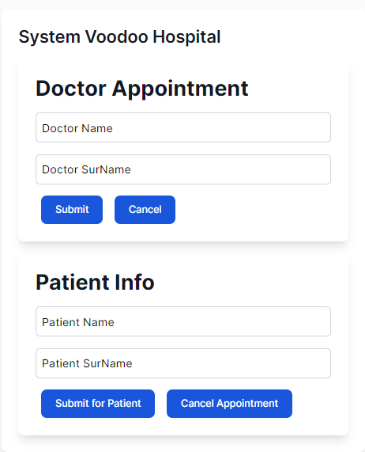

# Voodoo GUI

Voodoo GUI is a simple Python library to create user interfaces like Streamlit but with an intuitive and simpler syntax.

## Installation

```bash
pip install voodoo-gui
```

## Usage

Example code to create a simple page:

```python
from voodoo.gui import Gui
import voodoo.gui.builder as vo

text = "Original text"

with vo.Page() as page:
    vo.text("# Getting started with voodoo GUI", mode="md")
    vo.text(f"My text: {text}")

    vo.input(f"{text}")

Gui(page).run(debug=True)
```

Then run:

```bash
python voodoopy_gui_example.py
```

Access the page on `localhost:3000`.
    
## How it Works with A Sample 

The project uses the `voodoo.gui` library to create a GUI with two panels:

- **Doctor Appointment Panel**: Allows users to input a doctor's name and surname and submit or cancel the appointment. The information is printed to the console.
- **Patient Info Panel**: Allows users to input a patient's name and surname and submit or cancel the appointment. The information is printed to the console.

# Voodoo Hospital System

This project demonstrates the usage of the `voodoo.gui` library to build a GUI for managing doctor and patient information in a hospital system. The system allows users to input doctor and patient details and either submit or cancel these assignments.

## Features

- **Doctor Appointment Panel**: 
  - Input fields for doctor name and surname.
  - Buttons for submitting or canceling the appointment.

- **Patient Info Panel**:
  - Input fields for patient name and surname.
  - Buttons for submitting or canceling the patient appointment.

## Installation

1. Ensure you have `voodoo.gui` installed in your Python environment.
2. Clone or download the project files.

```bash
git clone https://github.com/your-repository-url
cd your-project-directory


### Code Overview

```python
from voodoo.gui import Gui
import voodoo.gui.builder as vo

def submit(state):
    print(f"Doctor Info: {state['input1']} , {state['input2']}")

def cancel(state):
    print(f"Doctor Assignment Cancelled Info: {state['input1']} , {state['input2']}")

def submitpatient(state):
    print(f"Patient Info: {state['input3']} , {state['input4']}")

def cancelpatient(state):
    print(f"Patient Assignment Cancelled Info: {state['input3']} , {state['input4']}")

if __name__ == "__main__":
    with vo.Page() as page:
        with vo.Panel() as panel1:
            panel1.text("Doctor Appointment", mode="md") \
                  .input(id="input1", text="Doctor Name") \
                  .input(id="input2", text="Doctor SurName") \
                  .button("Submit", "submit") \
                  .button("Cancel", "cancel")

        page.add_panel(panel1)
        
        with vo.Panel() as panel2:
            panel2.text("Patient Info", mode="md") \
                  .input(id="input3", text="Patient Name") \
                  .input(id="input4", text="Patient SurName") \
                  .button("Submit for Patient", "submitpatient") \
                  .button("Cancel Appointment", "cancelpatient")

        page.add_panel(panel2)

        page.Setup(title="System Voodoo Hospital")
    
    Gui(page).run(debug=True)
```


